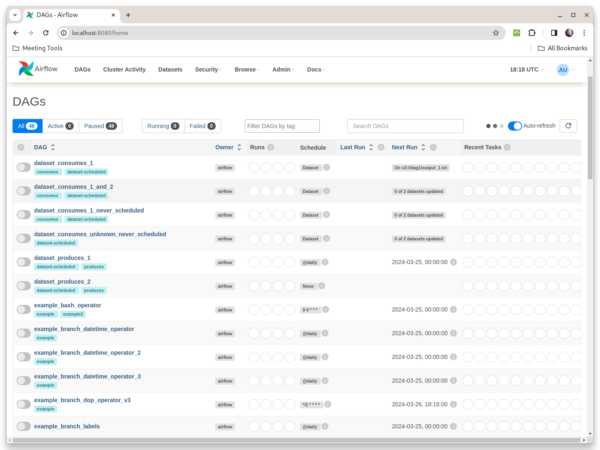

# Building a Data Pipeline

## Using Python Virtual Environment Strategy

We will operate the pipeline in a virtual environment:

```
export VIRTUAL_ENV=airflow.env
python3 -m venv $VIRTUAL_ENV
source $VIRTUAL_ENV/bin/activate
```

Install Airflow

```
export AIRFLOW=$(pwd)
export AIRFLOW_VERSION=2.8.4
export PYTHON_VERSION="$(python --version | cut -d " " -f 2 | cut -d "." -f 1-2)"
export CONSTRAINT_URL="https://raw.githubusercontent.com/apache/airflow/constraints-${AIRFLOW_VERSION}/constraints-${PYTHON_VERSION}.txt"

pip install "apache-airflow==${AIRFLOW_VERSION}" --constraint "${CONSTRAINT_URL}"
```

Start up airflow in standalone (non-production) mode

```
airflow standalone
```

You should see the following:

```
webserver  | [2024-03-26 11:11:01 -0700] [3281111] [INFO] Starting gunicorn 21.2.0
webserver  | [2024-03-26 11:11:01 -0700] [3281111] [INFO] Listening at: http://0.0.0.0:8080 (3281111)
webserver  | [2024-03-26 11:11:01 -0700] [3281111] [INFO] Using worker: sync
webserver  | [2024-03-26 11:11:01 -0700] [3281232] [INFO] Booting worker with pid: 3281232
webserver  | [2024-03-26 11:11:01 -0700] [3281233] [INFO] Booting worker with pid: 3281233
webserver  | [2024-03-26 11:11:01 -0700] [3281234] [INFO] Booting worker with pid: 3281234
webserver  | [2024-03-26 11:11:01 -0700] [3281235] [INFO] Booting worker with pid: 3281235
standalone | Airflow is ready
standalone | Login with username: admin  password: 5Q3cQKVvQMZVeWbT
standalone | Airflow Standalone is for development purposes only. Do not use this in production!
```

Note the username `admin` and the passowrd `5Q3cQKVvQMZVeWbT`.  This is needed to get into the airflow server.  Point your browser to http://localhost:8080 and login with the password show above.



## Using Containers Strategy

